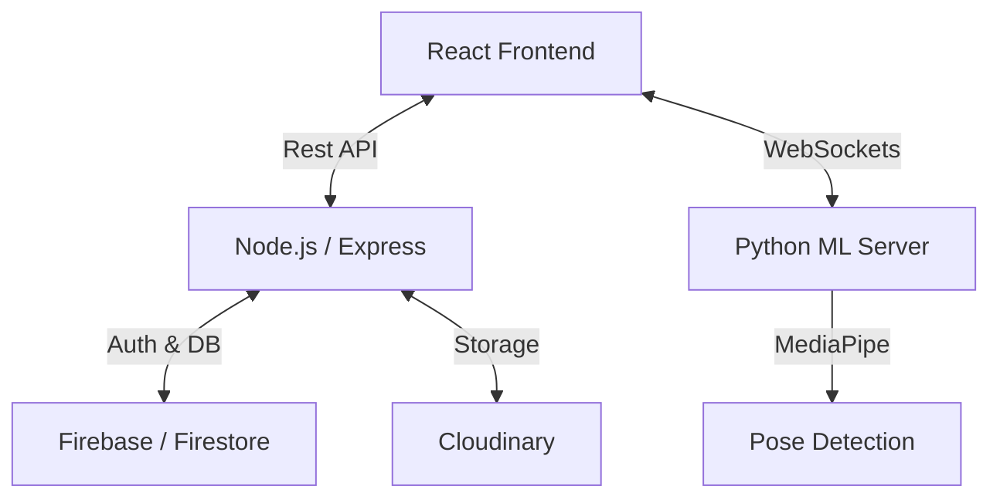

# 🧥 WearYourStyle — AI-Powered Fashion Marketplace

[](https://vitejs.dev/)
[](https://reactjs.org/)
[](https://nodejs.org/)
[](https://www.python.org/)
[](https://firebase.google.com/)
[](https://opensource.org/licenses/ISC)

**WearYourStyle** is a premium, full-stack e-commerce ecosystem that revolutionizes the online shopping experience. By integrating cutting-edge AI pose estimation with a high-performance marketplace, it provides users with a seamless and futuristic **Virtual Try-On** environment.

---

## 🌟 Vision
Traditional e-commerce lacks the "touch and try" feel. **WearYourStyle** bridges this gap using Computer Vision to allow users to visualize how clothes fit them in real-time, reducing return rates and increasing consumer confidence.

---

## ✨ Key Features

### 🤖 AI Virtual Try-On (Live Preview)
The core innovation of the platform. Using **MediaPipe Pose Landmarker** and **OpenCV**, the system detects user posture via webcam and overlays garments with precision.
- **Real-time Pose Tracking**: Detects 33 skeletal landmarks to map garment coordinates accurately.
- **Dynamic Physics-based Scaling**: Automatically adjusts the size of the garment based on shoulder width and torso distance.
- **WebSocket Synchronization**: High-speed frame processing via **Socket.IO** ensures a smooth, low-latency visual experience.

### 🛍️ Premium Marketplace
- **Curated Catalog**: Pre-seeded with over 200+ high-quality fashion products (Men & Women).
- **Advanced State Management**: Powered by **Redux Toolkit** for lightning-fast cart updates, wishlist persistence, and global UI state.
- **Responsive UX**: A mobile-first, glassmorphic design built with **Styled Components** and **Framer Motion**.

### 👗 Virtual Wardrobe & Outfit Builder
- **AI Recommendations**: Enhanced a Virtual Wardrobe system by integrating AI-based outfit recommendations using weather and user preferences.
- **Auto Categorization**: Implemented image classification for automatic clothing categorization.
- **Interactive Experience**: Designed an interactive outfit builder for improved user experience.

### 🔒 Robust Infrastructure
- **Secure Authentication**: Integrated with **Firebase Auth** and custom **JWT** implementations for enterprise-grade security.
- **Cloud-Native Storage**: Automated asset optimization and delivery via **Cloudinary**.
- **NoSQL Performance**: Real-time data sync using **Google Firestore**.

---

## 📐 System Architecture

The ecosystem operates on a **Tri-Server Microservices** model:



1.  **Client (Port 5173)**: React SPA handling UI rendering and webcam acquisition.
2.  **Server (Port 3000)**: Backend orchestrator for auth, product logic, and database management.
3.  **ML Server (Port 5000)**: Dedicated AI engine processing heavy CV tasks using Python.

---

## 🛠️ Technological Blueprint

| Layer | Technologies |
| :--- | :--- |
| **Frontend** | React 18, Vite, Redux Toolkit, Styled Components, Socket.io-client, React-Slick |
| **Backend** | Node.js, Express, Firebase Admin SDK, JWT, Multer, Bcrypt |
| **AI / ML** | Python 3.10+, MediaPipe, OpenCV, Flask-SocketIO, Eventlet |
| **DevOps** | Docker, Git, Railway (Deployment) |

---

## 📂 Project Structure

```bash
WearYourStyle/
├── Client/             # React SPA (Vite)
│   ├── src/components/ # Reusable UI atoms & organisms
│   ├── src/redux/      # Global state slices & store
│   └── src/screens/    # Main views (TryOn, Home, Checkout)
├── Server/             # Node.js Express API
│   ├── src/controllers/# Request handlers
│   ├── src/routes/     # API Endpoints
│   └── src/db/         # Firebase initialization
└── MlServer/           # Python AI Engine
    ├── main.py         # Socket.IO Socket Server
    ├── requirements.txt# ML dependencies
    └── pose_landmarker.task # MediaPipe pre-trained model
```

---

## 🚀 Installation & Local Setup

### Prerequisites
- **Node.js**: v18.0 or higher
- **Python**: v3.10 or higher
- **Firebase Project**: (Service Account JSON & Config Keys)
- **Cloudinary**: (Cloud Name, API Key, Secret)

### Step 1: Clone the Repository
```bash
git clone https://github.com/your-username/WearYourStyle.git
cd WearYourStyle
```

### Step 2: Configure the Backend (Node.js)
```bash
cd Server
npm install
# Create a .env file (see Configuration section below)
npm run dev
```

### Step 3: Configure the AI Engine (Python)
```bash
cd ../MlServer
pip install -r requirements.txt
# Ensure pose_landmarker.task is in the root of MlServer/
python main.py
```

### Step 4: Launch the Frontend (React)
```bash
cd ../Client
npm install
npm run dev
```

---

## ⚙️ Configuration (.env)

### `Server/.env`
```env
PORT=3000
FIREBASE_PROJECT_ID=your-project-id
FIREBASE_CLIENT_EMAIL=your-client-email
FIREBASE_PRIVATE_KEY="your-private-key"
ACCESS_TOKEN_SECRET=your-jwt-secret
CLOUDINARY_CLOUD_NAME=your-cloud-name
CLOUDINARY_API_KEY=your-api-key
CLOUDINARY_API_SECRET=your-api-secret
```

### `Client/src/config/apiConfig.js`
Ensure the URLs match your local environment:
```javascript
export const API_BASE_URL = "http://localhost:3000";
export const ML_BASE_URL = "http://localhost:5000";
```

---

## 🎥 Demonstration
[https://wear-your-style.vercel.app/](https://wear-your-style.vercel.app/)

*(Interactive walkthroughs and screenshots coming soon!)*

---

## 🤝 Contributing
1.  **Fork** the project.
2.  **Create** your feature branch (`git checkout -b feature/AmazingFeature`).
3.  **Commit** your changes (`git commit -m 'Add AmazingFeature'`).
4.  **Push** to the branch (`git push origin feature/AmazingFeature`).
5.  **Open** a Pull Request.

---

## 📄 License
Distributed under the **ISC License**. See `LICENSE` for more information.

## 📧 Contact
**Bharath Ganga** - [bharathganga7@gmail.com](mailto:bharathganga7@gmail.com)

---
*Designed with ❤️ by the WearYourStyle Engineering Team.*
